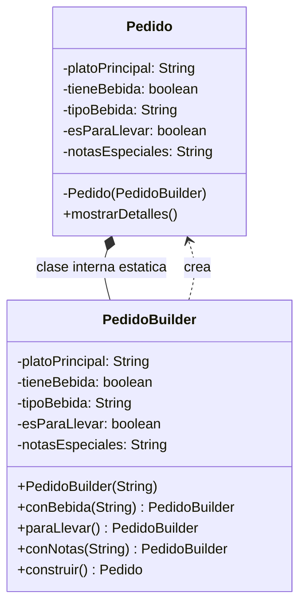
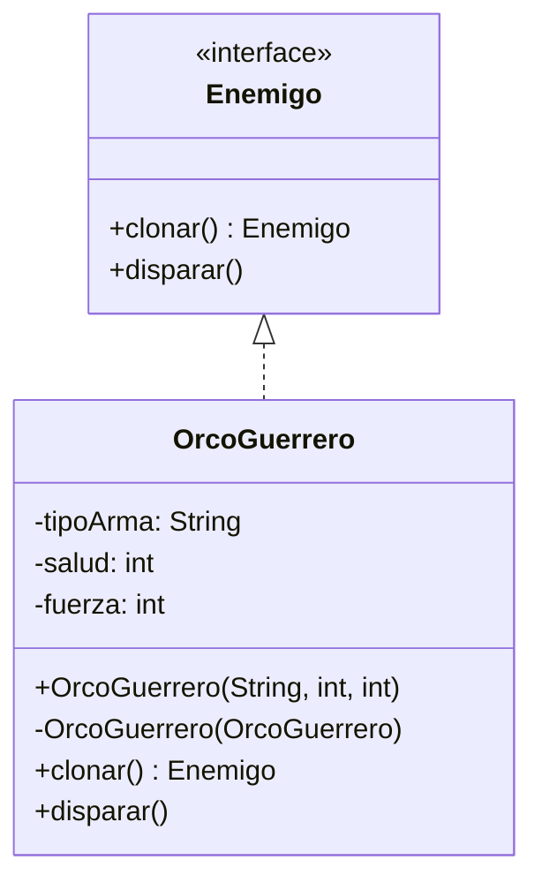

# Ejemplos Prácticos de Patrones Creacionales: Builder y Prototype

Este documento recopila los nuevos ejemplos aplicados para los patrones **Builder** y **Prototype**, incluyendo su estructura en diagramas de clases, código ejecutable y la justificación de su uso.

---

## 4. Builder (Ejemplo: Pedido de Comida)

### Descripción y Problema

El patrón Builder separa la construcción de un objeto complejo de su representación final. En nuestro ejemplo anterior con computadores, vimos cómo se evita el constructor telescópico. Aquí aplicamos el mismo principio para un sistema de **Pedidos de Comida**, donde un plato principal es obligatorio, pero las bebidas, opciones para llevar y notas especiales son totalmente opcionales.

### Estructura de la solución



### Código para probar

```java
// Pedido.java
public class Pedido {
    private final String platoPrincipal; // Obligatorio
    private final boolean tieneBebida;   // Opcional
    private final String tipoBebida;     // Opcional
    private final boolean esParaLlevar;  // Opcional
    private final String notasEspeciales;// Opcional

    private Pedido(PedidoBuilder builder) {
        this.platoPrincipal = builder.platoPrincipal;
        this.tieneBebida = builder.tieneBebida;
        this.tipoBebida = builder.tipoBebida;
        this.esParaLlevar = builder.esParaLlevar;
        this.notasEspeciales = builder.notasEspeciales;
    }

    public void mostrarDetalles() {
        System.out.println("Plato principal: " + platoPrincipal);
        System.out.println("¿Tiene bebida?: " + (tieneBebida ? "Sí (" + tipoBebida + ")" : "No"));
        System.out.println("¿Para llevar?: " + (esParaLlevar ? "Sí" : "No"));
        System.out.println("Notas: " + (notasEspeciales != null ? notasEspeciales : "Ninguna"));
    }

    public static class PedidoBuilder {
        private final String platoPrincipal; // Obligatorio para instanciar el builder
        private boolean tieneBebida = false;
        private String tipoBebida = null;
        private boolean esParaLlevar = false;
        private String notasEspeciales = null;

        public PedidoBuilder(String platoPrincipal) {
            this.platoPrincipal = platoPrincipal;
        }

        public PedidoBuilder conBebida(String tipoBebida) {
            this.tieneBebida = true;
            this.tipoBebida = tipoBebida;
            return this;
        }

        public PedidoBuilder paraLlevar() {
            this.esParaLlevar = true;
            return this;
        }

        public PedidoBuilder conNotas(String notas) {
            this.notasEspeciales = notas;
            return this;
        }

        public Pedido construir() {
            return new Pedido(this);
        }
    }
}

// App.java
public class App {
    public static void main(String[] args) {
        Pedido pedido1 = new Pedido.PedidoBuilder("Hamburguesa doble")
                .conBebida("Coca-Cola")
                .paraLlevar()
                .conNotas("Sin cebolla por favor")
                .construir();

        pedido1.mostrarDetalles();
    }
}
```

### Justificación

**Cuándo usarlo:** Úsalo cuando un objeto requiera múltiples configuraciones opcionales o cuando la creación deba leerse de forma clara y fluida (fluent interface), evitando cadenas kilométricas de parámetros booleanos o nulos en los constructores.

---

## 5. Prototype (Ejemplo: Personajes de Videojuego / Enemigos)

### Descripción y Problema

Permite copiar objetos existentes sin que el código dependa de sus clases concretas. En este ejemplo, instanciar un enemigo desde cero implica una carga costosa (simulada con lectura de recursos o retardos). Clonar una instancia ya configurada es mucho más eficiente que reconstruirla campo por campo.

### Estructura de la solución



### Código para probar

```java
// Enemigo.java
public interface Enemigo {
    Enemigo clonar();
    void disparar();
}

// OrcoGuerrero.java
public class OrcoGuerrero implements Enemigo {
    private String tipoArma;
    private int salud;
    private int fuerza;

    public OrcoGuerrero(String tipoArma, int salud, int fuerza) {
        this.tipoArma = tipoArma;
        this.salud = salud;
        this.fuerza = fuerza;
        // Simulamos una carga costosa (ej. lectura de archivos 3D o bases de datos)
        try { Thread.sleep(100); } catch (InterruptedException e) {}
    }

    // Constructor de copia profunda
    private OrcoGuerrero(OrcoGuerrero target) {
        this.tipoArma = target.tipoArma;
        this.salud = target.salud;
        this.fuerza = target.fuerza;
    }

    @Override
    public Enemigo clonar() {
        return new OrcoGuerrero(this);
    }

    @Override
    public void disparar() {
        System.out.println("Orco atacando con " + tipoArma + " (Salud: " + salud + ", Fuerza: " + fuerza + ")");
    }
}

// App.java
public class App {
    public static void main(String[] args) {
        // Creamos el prototipo base (carga pesada inicial)
        Enemigo prototipoOrco = new OrcoGuerrero("Hacha de dos manos", 100, 50);

        // Clonamos rápidamente en lugar de volver a crear desde cero
        Enemigo orco1 = prototipoOrco.clonar();
        Enemigo orco2 = prototipoOrco.clonar();

        System.out.println("--- Enemigos en partida ---");
        orco1.disparar();
        orco2.disparar();
    }
}
```

### Justificación

**Cuándo usarlo:** Úsalo cuando la inicialización de un objeto sea costosa en tiempo o recursos y ya dispongas de una plantilla o instancia similar que pueda ser duplicada de forma limpia mediante clonación.